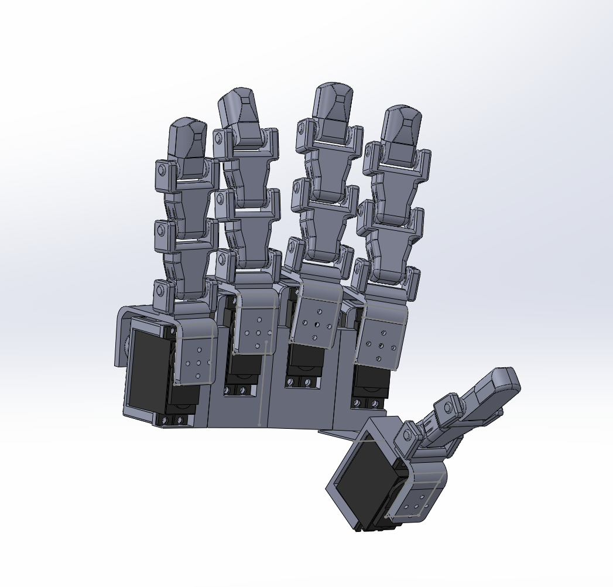

# 🤖 Robotic Hand (In Progress)

This repository documents the **design phase** of my robotic hand project. The goal is to develop a functional, tendon-driven robotic hand that mimics human finger motion using servo actuation and cable routing.

## 📌 Current Status
- ✅ Mechanical design in progress  
- ✅ Joint layout and cable routing concept  
- ⏳ Hardware build (upcoming)  
- ⏳ Control system implementation  

## 🛠 Design Focus
- Servo-driven tendon actuation  
- Joint geometry optimization  
- Range-of-motion analysis  
- CAD modeling and iteration  

## 🖼 Current Design Preview

## 🔜 Next Steps
- Finalize mechanical design  
- Fabricate components  
- Assemble prototype  
- Implement control logic  
- Perform testing and tuning  
